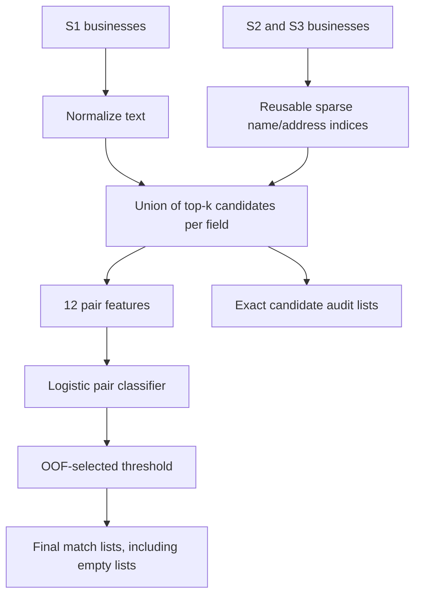

# Amazon-ML-Challange-2026

## Train in Google Colab

[](https://colab.research.google.com/github/alisalmann7386-crypto/Amazon-ML-Challange-2026/blob/main/notebooks/Colab_Baseline.ipynb)

**For the 2.2-million-S1 dataset, start with [the Colab notebook](notebooks/Colab_Baseline.ipynb) and [large-data instructions](COLAB.md).** The new disk-backed workflow uses SQLite token BM25 retrieval and incremental logistic training, with 20,000 sampled S1 entities by default and the full S2/S3 search catalog. It reports an independent group holdout score and saves the model to Drive. It needs no GPU.

| Entry point | Use |
| --- | --- |
| `src/scalable.py` | Large catalog, disk index, feature shards, sampled training, streamed predictions |
| `src/prepare_data.py` | Prepare canonical TSVs from Drive folders or ZIPs |
| `notebooks/Colab_Baseline.ipynb` | Clone, install, prepare, train, save, predict and package |
| `src/pipeline.py` | Original in-memory character TF-IDF baseline for small experiments |

The remaining quick-start and architecture below describe the original TF-IDF baseline. **Do not launch its in-memory training command on the full competition data.** Neural retrieval and reranking remain planned experiments. Both workflows have synthetic local tests; neither has a measured official-data score yet.

## Business Entity Resolution Toolkit

Match each **Source 1 business** to **zero, one, or many records in Sources 2 and 3** despite noisy names and addresses. A reproducible competition workspace with a working offline baseline, grouped validation, data analysis, strict TSV checks, and final submission packaging.

**Status:** executable baseline; synthetic smoke tests only. No official dataset, trained competition model, or leaderboard result is included. This is an independent participant repository, not an official Amazon resource.

| Task | Implementation |
| --- | --- |
| Candidate retrieval | Union of character TF-IDF name and address neighbors |
| Pair features | Name/address sequence and token similarity, exact matches, numeric overlap, missingness, country agreement |
| Matching model | Standardized logistic regression trained on retrieved pairs |
| Validation | Grouped out-of-fold predictions; shared labeled targets stay together |
| Decision rule | Global threshold selected using macro F0.5, including singletons |
| Outputs | `matching_results.tsv` and `candidate_pairs.tsv` |
| Advanced experiments | MiniLM, ANN retrieval, boosting, cross-encoder reranking: documented roadmap |

## Quick start

Python **3.11 or newer**. Run commands from the repository root.

```bash
python -m venv .venv
# Windows PowerShell:
.venv\Scripts\Activate.ps1
# Linux/macOS: source .venv/bin/activate
python -m pip install -r requirements.txt

python src/make_demo.py
python src/pipeline.py train --data demo_data/train --folds 3
python src/pipeline.py predict --data demo_data/test
python src/pipeline.py validate --data demo_data/test
python -m unittest discover -s tests -v
```

The demo is invented data for checking the software. Its scores do not estimate competition performance.

## Run on the challenge data

Place the organizer-provided TSVs under `student_resource/dataset/train/` and `student_resource/dataset/test/`. See the [data guide](student_resource/dataset/README.md).

```bash
python src/analyze.py --data student_resource/dataset/train
python src/pipeline.py train --data student_resource/dataset/train --k 20 --folds 5
python src/pipeline.py predict --data student_resource/dataset/test
python src/pipeline.py validate --data student_resource/dataset/test
python src/package_submission.py --team YOUR_TEAM --test-dir student_resource/dataset/test
```

Upload only `output/matching_results.tsv` for leaderboard scoring. The final package includes both output files and reproducible source code. Run the organizer's validator too, if supplied. Review and update the filled `Documentation_template.md` with your team details and actual results before final submission. The supplied [problem statement](student_resource/README.md) and [blank organizer template](student_resource/Documentation_template.md) are preserved unchanged. The organizer validator mentioned in that statement was not among the attached files; this repo includes its own checks via `pipeline.py validate`.

## Architecture



`--k 20` retrieves up to 20 name neighbors and 20 address neighbors from the **combined S2/S3 pool**: at most 40 unique candidates per S1. It is not necessarily 20 final candidates and does not guarantee all true matches. Only positive cosine matches enter the union. Candidate recall must be measured before relying on this cap.

The candidate output contains exactly the records the classifier scores. There is no forced top-1 match, no one-to-one assignment, and no country whitelist. France and missing country values pass through the same pipeline.

## Repository guide

| Path | Purpose |
| --- | --- |
| `src/core.py` | Data contract, normalization, retrieval, feature engineering, metric, output checks |
| `src/pipeline.py` | Training, OOF tuning, inference, evaluation, validation |
| `src/analyze.py` | Country coverage, missing fields, repeated names, match cardinality |
| `src/make_demo.py` | Synthetic train/test fixtures |
| `src/package_submission.py` | Validated competition ZIP generation |
| `tests/` | Metric, singleton, group leakage, empty fields, output and end-to-end checks |
| `student_resource/dataset/` | Dataset layout and schemas; raw data ignored by Git |
| `student_resource/Documentation/` | Architecture, experiment plan, validation and scaling notes |
| `student_resource/Submissions/` | Submission logbook; archives ignored by Git |
| `Documentation_template.md` | Working methodology draft |
| `REPRODUCE.md` | Instructions included in the final submission ZIP |

## Metric and validation

For each S1 entity, with true set `T`, predicted set `P`, and `TP = |T ∩ P|`:

`F0.5 = 1.25 × TP / (0.25 × |T| + |P|)` when `T` is nonempty.

A true singleton scores 1 for an empty prediction and 0 otherwise. Average across **all S1 records**. The implementation does not substitute micro-F1, pair accuracy, or an average over non-singletons.

The model JSON records the candidate recall, pair count, reduction ratio, selected threshold and OOF threshold-selection score. That score is used for model selection and can be optimistic; reserve an untouched group holdout for final comparison. All target texts are available to unsupervised retrieval during OOF evaluation, matching catalog-retrieval usage. Target labels are not used in indexing. See [validation notes](student_resource/Documentation/VALIDATION.md).

## Limits and next experiments

This baseline uses **exact sparse retrieval**, not an ANN index. It avoids a full dense S1-by-target matrix, but still performs a sparse search over the target catalog for each query and sorts nonzero scores. Large datasets require profiling and a scalable retrieval backend. Pair features and scores are held in memory during training.

The earlier Project Explanation design—MiniLM retrieval followed by a cross-encoder over a small shortlist—is captured in the [experiment roadmap](student_resource/Documentation/EXPERIMENTS.md). These neural stages are not silently approximated by the baseline or claimed as implemented.

## Reproducibility and fair play

- Only supplied records and labels enter this pipeline; no entity lookups, geocoding, or external enrichment.
- Deterministic candidate tie-breaking, fixed estimator seed, pinned dependencies.
- Raw datasets, model files, outputs and submission archives are excluded from Git.
- The original code is MIT licensed. Optional pretrained models must separately satisfy the organizer's MIT/Apache-2.0 and parameter-limit rules before use.
- Load only trusted `joblib` artifacts. Store the source commit and environment with every experiment.

## Acknowledgment

The workspace organization is inspired by [uditjain100/Amazon-ML-Challange-2025](https://github.com/uditjain100/Amazon-ML-Challange-2025). The task-specific code and documentation here were written for business entity resolution; no product-pricing dataset, source code, or claimed results were copied.
