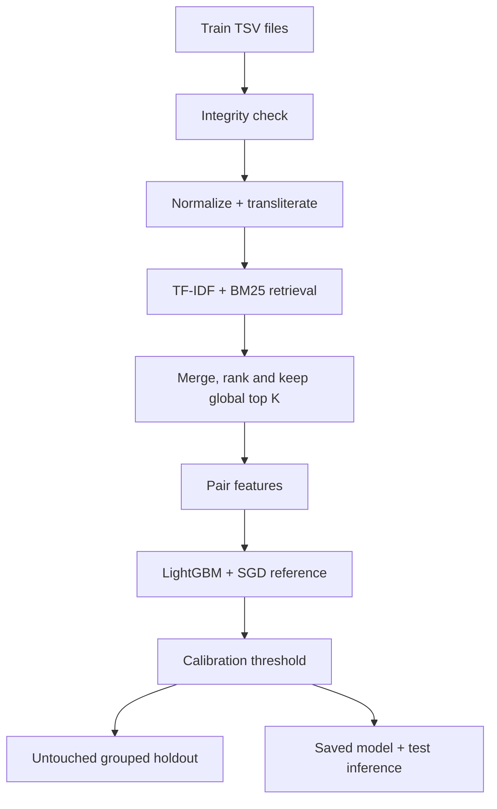

# Amazon ML Challenge 2026 - Business Entity Resolution

[](https://colab.research.google.com/github/alisalmann7386-crypto/Amazon-ML-Challange-2026/blob/main/notebooks/Colab_Baseline.ipynb)

This project matches each Source-1 business with zero, one, or several records from Source 2 and Source 3. It is designed for the real multilingual data and for a Colab-sized compute budget.

## Simple architecture



The default final candidate budget is **K=20 per Source-1 record**. K=50 is tested only when K=20 misses important true links. K=100 is intentionally excluded because it could create about 220 million full-run pairs.

## Important Source-3 protection

The project never silently drops malformed source rows:

- a row missing only its final country is preserved with a blank country;
- extra tab fragments are joined into the address field;
- every repair is written to the integrity/catalog report;
- other malformed shapes remain hard failures;
- original TSV bytes are never edited;
- copied files receive SHA-256, byte-count and physical-line verification.

Run the integrity check before EDA or indexing. It also verifies that every ground-truth target ID exists in the completed Source-2/Source-3 catalog. This distinguishes a real file-version mismatch from an incomplete `.building.sqlite` index.

## Recommended execution order

1. Prepare and verify the four training files.
2. Run the full integrity check.
3. Run EDA only after integrity passes.
4. Normalize all rows and build the target catalog.
5. Build TF-IDF and BM25 indexes.
6. Run the grouped training retrieval pilot at K=20; inspect K=50 only if needed.
7. Generate bounded feature shards, train LightGBM and the SGD reference, select the threshold on calibration, and report the untouched holdout.
8. When test files arrive, create an exact-match baseline submission first; then run hybrid inference.

Detailed rationale: [cost-aware blocking strategy](docs/BLOCKING_STRATEGY.md). Colab instructions: [COLAB.md](COLAB.md).

## Quick local smoke test

```bash
python -m pip install -r requirements.txt
python -m unittest discover -s tests -v
```

## Colab training commands

Place these files in `MyDrive/AmazonML2026/input/train/`:

```text
train_source1.tsv
train_source2.tsv
train_source3.tsv
train_ground_truth.tsv
```

The notebook runs the commands below with Drive checkpoints:

```bash
# Copy without changing the bytes; write prepare_manifest.json.
python src/prepare_data.py \
  --input /content/drive/MyDrive/AmazonML2026/input/train \
  --output dataset/train --split train

# Must pass before EDA/index construction.
python src/data_integrity.py \
  --data dataset/train --split train \
  --output artifacts/data_integrity.json

python src/eda.py --data dataset/train --config configs/baseline.json --output artifacts/eda
python src/io_utils.py --data dataset/train --split train --index artifacts/index_train --config configs/baseline.json
python src/tfidf_retriever.py --index artifacts/index_train --config configs/baseline.json
python src/bm25_retriever.py --index artifacts/index_train --config configs/baseline.json
python src/retrieval_evaluation.py --index artifacts/index_train --config configs/baseline.json --output artifacts/retrieval_pilot
python src/train.py --index artifacts/index_train --config configs/baseline.json \
  --work artifacts/run --final artifacts/final_model \
  --retrieval-output artifacts/retrieval_pilot \
  --error-output artifacts/error_analysis --skip-retrieval-eval
```

## How the blocker controls cost

For current pilot limitations and exact Drive output locations, read [COLAB.md](COLAB.md). The notebook now blocks model training when selected-K recall is missing or below the configured floor. This is a recall safety check, not a guarantee that a full run fits Colab memory or runtime. No new real-data score is claimed by software tests.

Each TF-IDF/BM25 channel retrieves its best results. The candidates are merged by target ID and ranked using reciprocal-rank fusion. Training and inference then keep only the best `blocking.final_k` unique targets; the default is 20.

The retrieval report measures both sides of cost:

- final candidate pairs requiring features and ML scoring;
- uncapped retrieval work, elapsed time, p95/p99 candidates and throughput.

A top-20 output does not guarantee cheap retrieval when common tokens create large posting lists. That is why the pilot records runtime as well as recall.

## Model and evaluation rules

- LightGBM is the primary model; SGD is the reference.
- Split by connected Source-1 label groups so related records cannot leak across partitions.
- Choose the probability threshold only on calibration.
- Never tune on the untouched holdout.
- Never inject true pairs into candidate lists.
- Report candidate recall separately from model precision, recall and macro F0.5.
- Synthetic and reduced-catalog results are smoke tests, not competition scores.

## Test inference

Place only the three test sources in `dataset/test/`. A `test_ground_truth.tsv` is neither expected nor created.

```bash
python src/inference.py --data dataset/test --index artifacts/index_test \
  --model-dir artifacts/final_model --output output/hybrid
python src/validate_submission.py --index artifacts/index_test --output output/hybrid
```

Create the fast no-ML leaderboard baseline from the same test index:

```bash
python src/exact_baseline.py --index artifacts/index_test --output output/exact_baseline
```

Both workflows write `candidate_pairs.tsv` and `matching_results.tsv`. Package the selected hybrid output with:

```bash
python src/package_submission.py --team YOUR_TEAM --hybrid-index artifacts/index_test \
  --model-dir artifacts/final_model --output output/hybrid
```

## Main outputs

| Path | Meaning |
| --- | --- |
| `dataset/train/prepare_manifest.json` | Copy hashes, sizes and physical line counts |
| `artifacts/data_integrity.json` | True row counts, repairs, duplicates and label-ID checks |
| `artifacts/retrieval_pilot/metrics.json` | K=20/K=50 recall and cost comparison |
| `artifacts/run/metrics.json` | Calibration and holdout metrics for LightGBM/SGD |
| `artifacts/final_model/model.joblib` | Saved primary model |
| `artifacts/final_model/threshold.json` | Calibration-selected threshold |
| `output/hybrid/candidate_pairs.tsv` | Exact candidates passed to the model |
| `output/hybrid/matching_results.tsv` | Final predictions |

Large TSVs, indexes and run artifacts remain outside Git. The repository contains code, documentation, tests and only explicitly labelled verification artifacts.

## Current results warning

The committed sampled-real metrics were produced with an earlier sampled catalog and configuration. They remain engineering evidence only. The earlier full-data EDA reported a Source-3 count that conflicts with the currently supplied file, so it is archived as stale until `src/data_integrity.py` completes on the exact four current files. See [real-results status](docs/REAL_RESULTS.md).

This is independent participant code, not official Amazon software.
