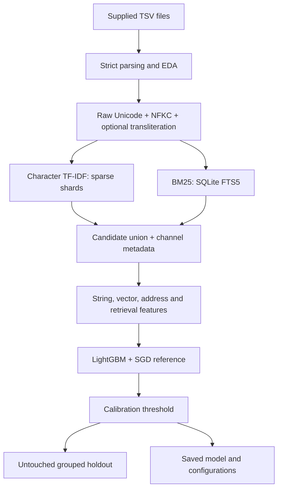

# Amazon-ML-Challange-2026

## Business Entity Resolution — multilingual hybrid baseline

[](https://colab.research.google.com/github/alisalmann7386-crypto/Amazon-ML-Challange-2026/blob/main/notebooks/Colab_Baseline.ipynb)

Match every S1 business to **zero, one, or multiple S2/S3 records**. The primary workflow combines character TF-IDF and BM25 candidates, optional offline transliteration, pair features, and LightGBM. It works on CPU; GPU is optional for LightGBM only.

**Verification:** all 16 unit/integration tests pass. A deterministic sampled-real run has been executed on 2,000 real S1 queries and 206,896 real S2/S3 targets; its metrics are engineering checks, not full-catalog competition scores. See [real results](docs/REAL_RESULTS.md) and [verification details](docs/VERIFICATION.md).

## Architecture



At inference, the same configuration builds **new test S2/S3 indexes**. Every test S1 is processed, including France and singletons. Test ground truth is neither expected nor fabricated.

## Quick start

Python 3.11+. Clone this repository and run from its root:

```bash
python -m pip install -r requirements.txt
python -m unittest discover -s tests -v
```

Put the four train TSVs under `dataset/train/`. `src/prepare_data.py` also accepts folders containing ZIPs. Large data stays outside Git. [Full Colab instructions](COLAB.md) include Drive paths and checkpoint handling.

For a bounded real-data check before the full Colab run:

```bash
python src/make_real_sample.py --data dataset/train --output artifacts/real_sample/data --queries 2000 --distractors-per-source 100000
python src/io_utils.py --data artifacts/real_sample/data --split train --index artifacts/real_sample/index --config configs/work_real_sample.json
python src/tfidf_retriever.py --index artifacts/real_sample/index --config configs/work_real_sample.json
python src/bm25_retriever.py --index artifacts/real_sample/index --config configs/work_real_sample.json
python src/retrieval_evaluation.py --index artifacts/real_sample/index --config configs/work_real_sample.json --output artifacts/real_sample/retrieval_comparison
python src/train.py --index artifacts/real_sample/index --config configs/work_real_sample.json --work artifacts/real_sample/run --final artifacts/real_sample/final_model --retrieval-output artifacts/real_sample/retrieval_comparison --error-output artifacts/real_sample/error_analysis --skip-retrieval-eval
```

```bash
# 1. EDA (0 = all rows; use --max-rows 10000 for a labeled prefix sample)
python src/eda.py --data dataset/train --output artifacts/eda

# 2. Strict ingest and persistent Unicode/transliterated representations
python src/io_utils.py --data dataset/train --split train --index artifacts/index_train

# 3. Separate retrieval indexes
python src/tfidf_retriever.py --index artifacts/index_train
python src/bm25_retriever.py --index artifacts/index_train

# 4. Compare TF-IDF / BM25 / hybrid / hybrid+transliteration on train groups only
python src/hybrid_retriever.py --index artifacts/index_train --output artifacts/retrieval_comparison

# 5. Optional labeled-pair EDA once indexes exist
python src/eda.py --data dataset/train --index artifacts/index_train --pairs-only --output artifacts/eda

# 6. Train both models, calibrate thresholds, evaluate fixed holdout, save artifacts
python src/train.py --index artifacts/index_train --work artifacts/run --final artifacts/final_model --skip-retrieval-eval
```

Omit `--skip-retrieval-eval` if step 4 wasn't run; training then runs the comparison first. All commands accept `--config configs/baseline.json` except inference, which uses the saved model configuration.

## Data and normalization

Sources: `entity_id`, `business_name`, `business_address`, `country`. Labels: `source1_entity_id`, `matched_entity_ids`. All files are tab-separated. IDs stay strings and have source prefixes. See [the supplied problem statement](student_resource/README.md) and [data contract](student_resource/dataset/README.md).

`normalize.py` preserves raw fields and creates normalized names/addresses, a secondary core name, and separate transliterated names/addresses. NFKC, Unicode casefold, whitespace and punctuation normalization retain combining marks. Legal suffixes are canonicalized, then stripped only from the secondary core-name representation. Address maps are configurable. `st → street` is **off by default** because “St” may mean “Saint”; enable it explicitly if validated on your data.

AnyAscii runs offline; it is transliteration, not translation or business lookup. Its spelling is approximate: `श्री बालाजी ट्रेडर्स` becomes `sri balaji tredrs`, not necessarily the exact English spelling. Original Unicode remains intact, while character similarity can bridge romanization differences. Results are compared with and without transliteration; improvement is not assumed.

## Retrieval and features

- Character TF-IDF: separate Unicode name/address and optional transliterated name/address indexes; float32 CSR shards; sparse top-N products; configurable 3–5 grams, `min_df`, vocabulary size and batching.
- **Vocabulary fitting uses a seeded sample of at most 100,000 target rows by default.** Every S2/S3 record is then transformed and searched. Set `vocabulary_sample=0` only with enough memory for full-catalog vocabulary fitting.
- BM25: field-specific SQLite FTS5 queries preserve native scores (smaller/more negative means stronger), ranks and channel flags. SQLite is storage/indexing; BM25 is the ranking function.
- Candidate union: no label injection, no forced match, no country exclusion. Up to 8 channels × configured k before deduplication; the union is not silently capped at 20.
- Features: Levenshtein, Jaro/Jaro-Winkler, Jaccard, overlap/containment, token-set/sort scores, core/exact matches, true pairwise character and word TF-IDF cosine, numeric/postal/house-number heuristics, script/country agreement, rare-token overlap, retrieval scores and interaction flags. Feature order is persisted and validated.

All retrieved positives and negatives are retained. Negatives ranked in the top 5 of any channel are counted as hard negatives; other retrieved negatives are normal negatives. Random negatives are created only for descriptive EDA, not inserted into training.

## Training and evaluation

Default: deterministically sample **20,000 S1 records**, then split approximately **60% train / 20% calibration / 20% holdout**. The full S2/S3 catalog is used for retrieval. Connected components of the full supplied label graph keep linked S1 records together, even through unsampled intermediaries. Text-only target vocabulary/index statistics are transductive; holdout labels do not fit the model or select thresholds.

LightGBM is the primary model chosen before holdout evaluation. SGD uses the same features, candidates and splits as a reference. Thresholds maximize exact macro F0.5 on calibration; ties choose the higher threshold. Singleton-empty predictions receive 1 and singleton false merges receive 0. Reports include micro precision/recall (explicitly labeled), false positives/negatives, predicted match count, singleton accuracy, and breakdowns by country/script/cardinality.

Retrieval reports include micro recall, macro coverage over non-singletons, counts and reduction ratio. Recall@5/10/20/30/50 uses reciprocal-rank fusion; raw union metrics use configured channel caps. See report `scope` for the exact definition. Undefined recall for singleton-only slices is `null`, not a misleading 1.

## Saved outputs

| Path | Contents |
| --- | --- |
| `artifacts/eda/` | Source/label statistics, sampled positive/random/hard pairs and similarity distributions |
| `artifacts/retrieval_comparison/metrics.json` | A/B/C/D retrieval comparisons and channel attribution |
| `artifacts/retrieval_comparison/transliteration.json` | Comparison with/without transliteration |
| `artifacts/run/metrics.json` | LightGBM and SGD calibration/holdout metrics |
| `artifacts/final_model/model.joblib` | Primary model, threshold, fixed feature names and full configuration |
| `artifacts/final_model/threshold.json` | Calibration-selected threshold |
| `artifacts/final_model/feature_names.json` | Feature schema/order |
| `artifacts/final_model/model_config.json` | Full reproduction configuration |
| `artifacts/final_model/normalization_config.json` | Text rules |
| `artifacts/final_model/transliteration_config.json` | Transliteration configuration |
| `artifacts/final_model/feature_importance.csv` | LightGBM gain and split counts |
| `artifacts/final_model/train_metrics.json` | Training run report |
| `artifacts/final_model/manifest.json` | Data hashes, configurations, exact split IDs |
| `artifacts/error_analysis/` | Wrong merges, misses, retrieval misses, script/transliteration and numeric slices |

## Test inference and submission

After receiving the three **test** source files:

```bash
python src/inference.py --data dataset/test --index artifacts/index_test --model-dir artifacts/final_model --output output
python src/validate_submission.py --index artifacts/index_test --output output
python src/package_submission.py --team YOUR_TEAM --hybrid-index artifacts/index_test --model-dir artifacts/final_model --output output
```

Outputs: `output/candidate_pairs.tsv`, `output/matching_results.tsv`, `output/submission.zip`. The candidate TSV is precisely the union passed to the classifier. Each S1 appears exactly once, matched IDs are unique valid targets, and matches are a subset of candidates. Complete team details and measured results in `Documentation_template.md` before final packaging. The package carries source, pinned requirements, configurations and the trained model. [Package reproduction guide](REPRODUCE_HYBRID.md).

## Scaling and current limits

There is no dense all-pairs matrix. Catalogs are disk-backed, TF-IDF transformations/search are sharded, feature arrays are float32, and feature/inference shards support resume. Training arrays are memory-mapped, but **LightGBM binning and calibration scores still require RAM proportional to the sampled candidate set**. The full 2.2M S1 set is not trained by default.

Full-catalog sparse search scans disk shards per query batch. This trades lower peak memory for I/O and is not an ANN index. Millions of targets can require substantial disk and runtime; no full-scale performance guarantee is made. Start with a smaller S1 sample and inspect logs: vocabulary/shape/nnz/memory, index build time, queries/sec and feature pairs/sec. Resume uses fingerprints/config manifests; completed catalog builds are reused, incomplete catalog imports restart, completed TF-IDF/feature/inference shards resume. A forced Colab reset can lose local work since the last Drive checkpoint.

Postal/house-number and script labels are heuristics, not address validation. Raw BM25 magnitudes and TF-IDF vocabularies may shift on a new catalog; validate by country and noise type. AnyAscii may lose distinctions or render languages imperfectly. No MiniLM, FAISS, transformer or cross-encoder is required.

## Repository continuity

Original `core.py`, `pipeline.py`, `scalable.py`, `analyze.py`, ZIP preparation, tests and package modes remain available. [Audit](docs/AUDIT.md), [legacy README](docs/LEGACY_README.md), [legacy Colab guide](docs/LEGACY_COLAB.md). Legacy document links assume their original root location.

The workspace organization was inspired by [uditjain100/Amazon-ML-Challange-2025](https://github.com/uditjain100/Amazon-ML-Challange-2025). This is independent participant code, not official Amazon software. Original code is MIT licensed; dependencies retain their own licenses. No external business data, geocoding or identity enrichment is used. [Dependency notes](docs/DEPENDENCIES.md).
